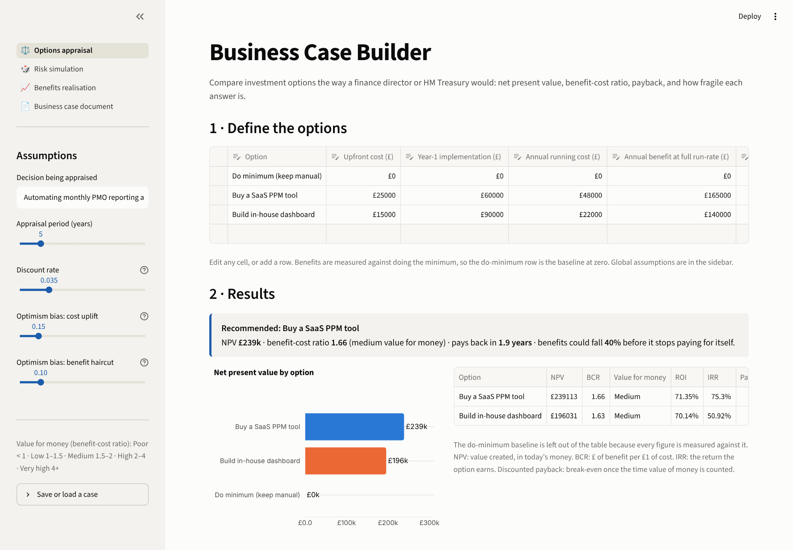
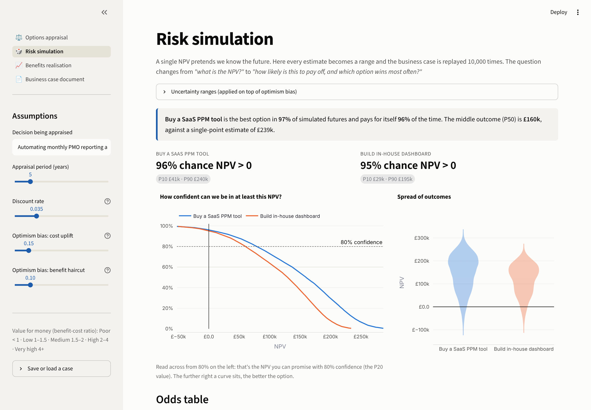
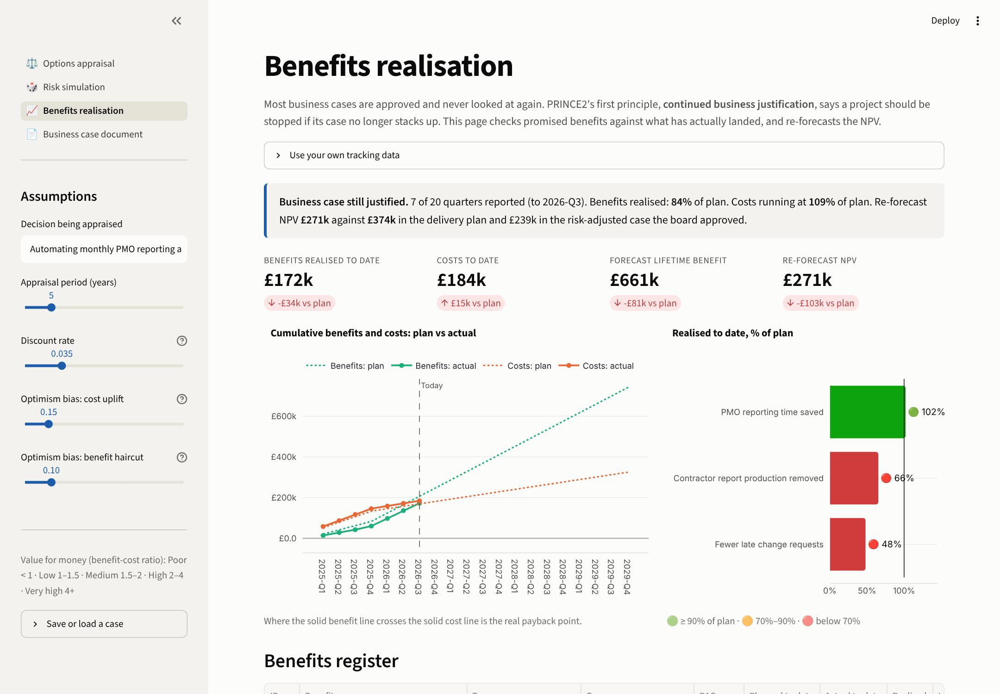

# Business Case Builder

**▶ Live app: [businesscase-dsmk.streamlit.app](https://businesscase-dsmk.streamlit.app)** · no install needed

**From "should we invest?" to "did it pay off?": the whole lifecycle of a business case in one tool.**

Most business cases are a spreadsheet nobody trusts. They hold a single NPV, assume everything goes to plan, and are never looked at again once approved. This app does what a finance director, a PMO lead or HM Treasury reviewer actually asks for:

1. **Options appraisal.** Compare options on NPV, benefit-cost ratio, IRR and payback, with optimism bias applied the way the Green Book requires.
2. **Risk simulation.** Replay the case 10,000 times to answer *"how likely is this to pay off, and which option wins most often?"*
3. **Benefits realisation.** After approval, track promised benefits against actuals and re-forecast the NPV. Is the case still justified?
4. **Business case document.** Export a board-ready Word document structured on the **HM Treasury Five Case Model**.



> 📄 **Don't want to run code?** Open the [sample business case (Word)](docs/sample_business_case.docx) the app generates.

---

## The worked example

*Should a PMO automate its monthly reporting across a 40-project portfolio?* (Fictional figures.)

| Option | NPV | BCR | Payback |
|---|---|---|---|
| Do minimum (keep manual) | baseline | – | – |
| **Buy a SaaS PPM tool** | **£239k** | **1.66** | **1.9 yrs** |
| Build in-house dashboard | £196k | 1.63 | 2.5 yrs |

**The interesting part: the answer flips.** On raw estimates the in-house build wins. Apply a realistic **delivery-risk uplift** (bespoke builds overrun far more than off-the-shelf purchases), and the SaaS tool comes out ahead. The risk simulation agrees: SaaS is the better option in **97% of 10,000 simulated futures**. That is the kind of judgement a business case exists to surface.

**Eighteen months later**, the benefits tracker shows:
- Reporting time saved: 🟢 **102%** of plan.
- Contractor spend removed: 🔴 started 3 quarters late, now **recovering**.
- Fewer late change requests: 🔴 stuck at **48%**, an adoption problem that needs a recovery plan.
- Costs are running at **109%** of plan.
- Re-forecast NPV: **£271k**, down from £374k in the delivery plan but still above the £239k risk-adjusted case the board approved. **Verdict: still justified**, because the optimism-bias allowance is absorbing the shortfall. B3 needs fixing before it eats the rest.

| | |
|---|---|
|  |  |

## Features

**Options appraisal**
- Editable options table (add, remove or edit options live) plus global assumptions in the sidebar.
- NPV, BCR, ROI, IRR, payback and discounted payback for every option.
- Green Book discount rate (3.5%), optimism bias on costs and benefits, and an extra delivery-risk uplift per option.
- Value-for-money bands (Poor / Low / Medium / High / Very high) used across UK government.
- Tornado chart showing which estimate the answer depends on most, plus pessimistic / base / optimistic scenarios and break-even headroom.
- Save and load a case as JSON. The [Process Improvement Lab](https://github.com/Divyaprakash-SM/process-improvement-lab) exports in this format, so process savings measured from real event data load straight in as an investment option.

**Risk simulation (Monte Carlo)**
- Costs, benefits and benefit start dates become lopsided ranges, because real projects overrun far more than they underrun.
- 10,000 runs using *common random numbers*, so options are compared like-for-like.
- P10 / P50 / P90 NPV, the chance NPV > 0, and the chance each option is the best.
- An S-curve ("probability NPV is at least X") and a spread-of-outcomes chart.

**Benefits realisation**
- Benefits register with owners and benefit types (cashable, efficiency, cost avoidance).
- Quarterly plan vs actual for benefits and costs, with a red/amber/green status per benefit.
- Forecasts weighted to the **last two quarters**, so a recovering benefit isn't judged on its slow start.
- Re-forecast NPV and a **continued business justification** verdict (PRINCE2 principle 1).
- Auto-written actions for the benefits review.
- Upload your own CSVs to track a real project.

**Business case document**
- A Word export in Five Case Model order: strategic, economic, commercial, financial, management.
- Economic and financial sections are written automatically from the numbers, with tables and charts.
- You write only the parts a person has to: case for change, objectives, procurement route, governance.

## The numbers, in plain English

| Term | Meaning |
|---|---|
| **NPV** (net present value) | Total benefits minus total costs, with future money shrunk to today's value (£100 in five years is worth less than £100 now). Positive = creates value. |
| **BCR** (benefit-cost ratio) | £ of benefit per £1 of cost. 2.0 = every pound returns two. |
| **IRR** (internal rate of return) | The return the investment earns. Compare it with the cost of borrowing. |
| **Payback** | When cumulative cash flow turns positive. |
| **Optimism bias** | The proven tendency to under-estimate costs and over-estimate benefits. The Green Book requires an up-front correction. |
| **P10 / P50 / P90** | Bad / middle / good outcomes: 10%, 50% and 90% of simulations land below these values. |

## Run it

```bash
git clone https://github.com/Divyaprakash-SM/business-case-builder.git
cd business-case-builder
pip install -r requirements.txt
streamlit run app.py
```

```bash
pytest                           # 22 tests: finance formulas by hand, simulation, benefits, Word export
python -m appraisal.example_data # rebuild the example tracking data
```

## How it's built

```
business-case-builder/
├── app.py                 # navigation + shared assumptions sidebar
├── views/                 # one file per page
├── appraisal/
│   ├── model.py           # NPV, BCR, IRR, payback, tornado, scenarios
│   ├── simulation.py      # Monte Carlo engine (vectorised NumPy, 10k runs in milliseconds)
│   ├── benefits.py        # realisation tracking and business-case re-validation
│   ├── document.py        # Five Case Model Word export (python-docx + matplotlib)
│   └── report.py          # one-page Markdown summary
├── data/                  # example benefits register and quarterly tracking
└── tests/
```

**Design choices**
- **Calculations are kept separate from the screens.** Every formula lives in `appraisal/` with no interface code, so it can be tested and reused.
- **Every key formula is tested against a hand calculation.** Examples: NPV of −100, +50, +50, +50 at 10% = 24.34; IRR = 23.4%.
- **One source of truth.** The dashboard, the Word document and the summary all read from the same engine, so they cannot disagree.

**Stack:** Python · pandas · NumPy · Plotly · Streamlit · python-docx · matplotlib · pytest

## Deploy free

[share.streamlit.io](https://share.streamlit.io) → **Create app** → pick this repo, branch `main`, file `app.py` → **Deploy**.

## Roadmap
- Non-monetised benefits scoring (multi-criteria analysis)
- Real-terms (inflation-adjusted) appraisal

---

**Divyaprakash S M** · PMP · PRINCE2 Agile Practitioner · MSc Business Analytics (University of Southampton)
